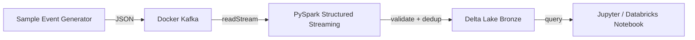

# Live Demo Plan — Kafka → PySpark → Delta Lake

**Goal:** Produce recruiter-verifiable proof that the strongest project runs end-to-end.

---

## Demo project

**Kafka → PySpark → Delta Lake Pipeline**

This is the strongest project because it has:
- A measurable benchmark (31k–45k rows/sec).
- End-to-end architecture, system design, and deployment docs.
- AWS Terraform code, GitHub Actions CI/CD, and monitoring.
- A clear data path: Kafka → Spark → Delta Lake.

---

## Demo architecture



---

## Demo environment (local)

**Time to first event:** ~3 minutes  
**Cost:** $0

```bash
# 1. Start Kafka and Zookeeper
docker-compose up -d

# 2. Install Python dependencies
python -m venv .venv
source .venv/bin/activate  # Windows: .venv\Scripts\activate
pip install -e ".[dev]"

# 3. Produce 100k sample events
python scripts/generate_sample_events.py --topic events --count 100000

# 4. Run the streaming job
python -m pipeline.streaming_job
```

**Expected output**

```bash
# Delta transaction log
ls data/delta/events/_delta_log/

# Partitioned Parquet files
ls data/delta/events/event_date=2026-07-22/
```

---

## Demo environment (AWS)

**Time to first event:** ~20 minutes  
**Cost:** ~$5–$10 for a 1-hour run if destroyed after use.

```bash
cd Kafka-pyspark-delta-pipeline/deploy/aws
cp terraform.tfvars.example terraform.tfvars
# edit: environment = "demo", alert_email = "you@example.com"

terraform init
terraform plan -out=tfplan
terraform apply tfplan

# Capture outputs
terraform output -raw s3_bucket
terraform output -raw msk_bootstrap_brokers
terraform output -raw emr_application_id
terraform output -raw emr_execution_role_arn

# Upload job artifact
aws s3 cp src/pipeline/streaming_job.py \
  s3://$(terraform output -raw s3_bucket)/jobs/streaming_job.py

# Submit EMR Serverless job
aws emr-serverless start-job-run \
  --application-id <emr_application_id> \
  --execution-role-arn <emr_execution_role_arn> \
  --job-driver '{
    "sparkSubmit": {
      "entryPoint": "s3://<bucket>/jobs/streaming_job.py",
      "entryPointArguments": [],
      "sparkSubmitParameters": "--conf spark.jars.packages=org.apache.spark:spark-sql-kafka-0-10_2.12:3.5.0,io.delta:delta-core_2.12:2.4.0 --conf spark.sql.extensions=io.delta.sql.DeltaSparkSessionExtension --conf spark.sql.catalog.spark_catalog=org.apache.spark.sql.delta.catalog.DeltaCatalog"
    }
  }'

# Verify Delta data in S3
aws s3 ls s3://<bucket>/delta/events/_delta_log/
```

**Capture evidence**

- MSK cluster active.
- EMR Serverless job run `Success`.
- S3 `_delta_log/` and `event_date=` partitions exist.
- CloudWatch log group shows checkpoint commits.
- Terraform `apply` terminal output.

---

## Demo checklist

- [ ] Local Docker Compose runs without errors.
- [ ] 100k events are generated and written to Delta Lake.
- [ ] `pytest` passes with the demo data.
- [ ] AWS `terraform apply` creates all resources.
- [ ] EMR Serverless job completes successfully.
- [ ] S3 contains Delta transaction log files.
- [ ] Screenshots are captured for portfolio and README.
- [ ] `terraform destroy` is run after evidence capture.

---

## Evidence to capture

| # | Evidence | Where to store |
|---|---|---|
| 1 | Kafka topic list / MSK cluster overview | `docs/images/aws/01-kafka.png` |
| 2 | Spark streaming job running / EMR job run success | `docs/images/aws/02-spark.png` |
| 3 | Delta Lake `_delta_log` and data files in S3 | `docs/images/aws/03-s3.png` |
| 4 | CloudWatch logs showing checkpoint commits | `docs/images/aws/04-cloudwatch.png` |
| 5 | Throughput benchmark chart | already exists in `docs/assets/benchmark-chart.svg` |
| 6 | Terminal `terraform apply` success | `docs/images/aws/06-terraform.png` |
| 7 | GitHub Actions workflow run | `docs/images/aws/07-github-actions.png` |
| 8 | Databricks / notebook query of the Delta table | `docs/images/aws/08-databricks.png` |

---

## Public showcase strategy

1. **Add the 8 screenshots** to `Kafka-pyspark-delta-pipeline/docs/images/aws/`.
2. **Update `README.md`** with a "Live Deployment Gallery" section.
3. **Add a "Proof" page** to the portfolio (`proof.html`) linking to the live evidence.
4. **Write a LinkedIn post** for each major milestone:
   - "I just deployed a Kafka → PySpark → Delta Lake pipeline on AWS."
   - "Here are 8 screenshots that prove the pipeline runs end-to-end."
   - "What I learned from benchmarking 45k rows/sec on a laptop."
5. **Publish a Medium article** with the live AWS screenshots embedded.
6. **Add a badge** to the README: `AWS Demo` or `Live Deployment`.
7. **Use one screenshot as the project thumbnail** in the portfolio.
