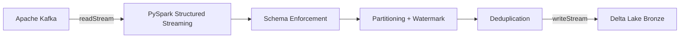

# Building a Production-Style Kafka → PySpark → Delta Lake Pipeline

**Sasidhar Mopuru** · Data & AI Platform Engineer · [Portfolio](https://sasireddy001.github.io/Portfolio/)

---

## Introduction

Real-time event pipelines are the backbone of modern data platforms. Whether it is user clicks, IoT telemetry, or microservice events, the expectation is the same: data must land fast, stay accurate, and remain available for analytics and ML.

In this article, I walk through a production-style streaming pipeline that ingests JSON events from **Apache Kafka**, processes them with **PySpark Structured Streaming**, and writes the results to **Delta Lake** with exactly-once semantics. The project is designed to run locally with Docker, on **Databricks**, or on **AWS EMR Serverless**.

## What the Pipeline Does

The pipeline covers the "bronze" ingestion layer:

1. Events are published as JSON to a Kafka topic.
2. Spark reads micro-batches using `readStream`.
3. Each event is parsed and validated against a known schema.
4. `ingested_at`, `event_date`, and `event_hour` columns are added.
5. Deduplication uses a watermark on `event_timestamp` plus `dropDuplicates("event_id")`.
6. Cleansed data is written to a Delta Lake bronze table with checkpointing.

```python
# Simplified core flow
df = (
    spark.readStream
    .format("kafka")
    .option("kafka.bootstrap.servers", cfg.kafka_bootstrap_servers)
    .option("subscribe", cfg.kafka_topic)
    .load()
    .select(from_json(col("value").cast("string"), EVENT_SCHEMA).alias("event"))
    .select("event.*")
    .withColumn("ingested_at", current_timestamp())
    .withColumn("event_date", to_date(col("event_timestamp")))
    .withColumn("event_hour", hour(col("event_timestamp")))
    .withWatermark("event_timestamp", "10 minutes")
    .dropDuplicates(["event_id"])
)

df.writeStream \
    .format("delta") \
    .option("checkpointLocation", cfg.checkpoint_path) \
    .outputMode("append") \
    .start(cfg.delta_path)
```

## Architecture



## Key Design Decisions

### 1. Exactly-Once Semantics
Kafka offsets are tracked in the Spark checkpoint. Delta Lake idempotent writes ensure that replayed offsets do not create duplicates. Restarting the job resumes from the last checkpoint without data loss or duplication.

### 2. Watermark-Based Deduplication
Unbounded state is a common failure mode in streaming joins and `dropDuplicates`. A 10-minute watermark caps the state store while still handling late-arriving events within a reasonable window.

### 3. Environment-Driven Configuration
The same code runs locally, on Databricks, and on AWS EMR Serverless. Kafka brokers, Delta paths, and checkpoint locations are read from environment variables, making the package portable across environments.

### 4. Testing Strategy
Core transformation logic is unit-tested with `pytest` and an in-memory Spark fixture. Mocks isolate Kafka and external state, achieving **90%+ coverage** on the transformation module.

## Performance Benchmarks

On a 4-core laptop with a single-node Spark and Docker Kafka:

| Rows | Duration | Throughput |
|---|---|---|
| 100k | ~3.2 s | ~31k rows/s |
| 1M | ~22 s | ~45k rows/s |

These are single-node numbers. On Databricks or EMR with a proper cluster, throughput scales horizontally with topic partitions and executor count.

## Cloud Deployment

I also added an **AWS deployment** that provisions:
- Amazon MSK Serverless for Kafka
- Amazon EMR Serverless for Spark
- Amazon S3 for Delta Lake and checkpoints
- Terraform modules for infrastructure as code
- GitHub Actions workflow for CI/CD

See the [deploy/aws](https://github.com/Sasireddy001/Kafka-pyspark-delta-pipeline/tree/main/deploy/aws) directory for the full setup.

## Lessons Learned

- **Schema enforcement early.** Validating the JSON payload before parsing prevents corrupt events from poisoning the Delta table.
- **Partition by event time, not ingestion time.** Querying downstream analytics is much faster when partitions reflect business time.
- **Checkpoints are production-critical.** Without them, a Spark driver restart replays the entire topic and creates duplicates.
- **Start simple, then add failure modes.** A working local pipeline is the prerequisite for meaningful cloud tuning.

## Try It Yourself

```bash
git clone https://github.com/Sasireddy001/Kafka-pyspark-delta-pipeline.git
cd Kafka-pyspark-delta-pipeline
docker-compose up -d
pip install -e ".[dev]"
python -m pipeline.streaming_job
```

## Conclusion

This pipeline is a small but complete example of how to build a testable, portable, and production-aware streaming data system. The combination of Kafka, PySpark, Delta Lake, and CI/CD gives a solid foundation for real-time data products.

If you are building similar systems, I would love to connect.
