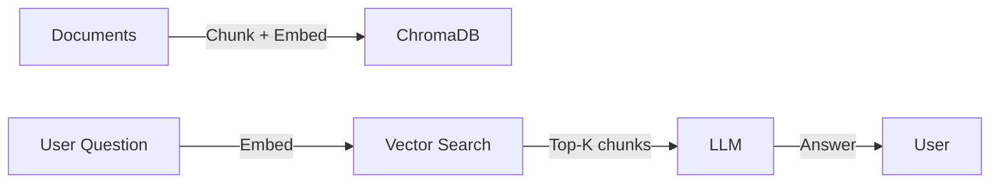

# Building a RAG Document QA System with FastAPI, ChromaDB, and Ollama

**Sasidhar Mopuru** · Data & AI Platform Engineer · [Portfolio](https://sasireddy001.github.io/Portfolio/)

---

## Introduction

Retrieval-Augmented Generation (RAG) is the fastest way to make LLMs useful on private data. Instead of fine-tuning a model, RAG retrieves the most relevant document chunks for a question and feeds them to the LLM as context. This keeps costs low, hallucinations controlled, and answers grounded.

In this article, I explain how I built a **RAG Document QA Chatbot** using **FastAPI**, **ChromaDB**, and **Sentence-Transformers**, with support for both local **Ollama** and cloud **OpenAI** backends.

## What the Application Does

The system answers questions against a private document corpus:

1. Upload or place PDF, Markdown, and TXT files in a folder.
2. The ingestion pipeline extracts text, splits it into overlapping chunks, and embeds each chunk with a local sentence-transformer model.
3. Vectors and metadata are stored in **ChromaDB**.
4. A user asks a question through the Streamlit UI or the FastAPI `/query` endpoint.
5. The question is embedded, the top-K chunks are retrieved, and an LLM generates an answer from the retrieved context.



## Tech Stack

| Component | Tool | Why |
|---|---|---|
| Ingestion | `PyPDF`, custom chunker | Handles PDF, TXT, and Markdown |
| Embeddings | `sentence-transformers` all-MiniLM-L6-v2 | Fast, small, no API cost |
| Vector DB | ChromaDB | Local-friendly, zero setup |
| API | FastAPI | Async, typed, self-documenting |
| UI | Streamlit | Quick chat interface |
| LLM | Ollama / OpenAI | Local dev vs. production quality |
| CI/CD | GitHub Actions + pytest | Fast, mocked unit tests |

## Core Code Patterns

### Modular provider interface

```python
# llm.py
class LLMProvider(Protocol):
    def generate(self, prompt: str) -> str: ...

class OllamaProvider:
    def generate(self, prompt: str) -> str:
        return requests.post(OLLAMA_URL, json={"model": self.model, "prompt": prompt}).text
```

This design lets you switch from local Ollama to OpenAI with one environment variable:

```bash
LLM_PROVIDER=ollama  # or openai
OPENAI_API_KEY=sk-...
```

### Chunking strategy

```python
chunks = []
for i in range(0, len(text), chunk_size - overlap):
    chunk = text[i:i + chunk_size]
    chunks.append({"text": chunk, "source": source, "index": i})
```

A small overlap preserves context across chunk boundaries. For example, a sentence that ends at the boundary of one chunk and begins the next is not split mid-idea.

### Query pipeline

```python
@app.post("/query")
def query(request: QueryRequest):
    q_vector = embedding_model.encode(request.question)
    results = collection.query(query_embeddings=[q_vector], n_results=3)
    context = "\n\n".join(results["documents"][0])
    prompt = f"Answer based on the context.\n\nContext: {context}\n\nQuestion: {request.question}"
    answer = llm.generate(prompt)
    return {"answer": answer, "sources": results["metadatas"][0]}
```

## Design Decisions and Tradeoffs

### ChromaDB vs. a managed vector store
- **ChromaDB** is perfect for local development and demos. It requires no infrastructure and stores the vector index in a local directory.
- **Pinecone, Weaviate, or pgvector** are the production choices. They offer horizontal scaling, replication, and RBAC. I abstracted the vector store layer so the swap is one implementation change.

### Sentence-Transformers all-MiniLM-L6-v2 vs. larger models
- `all-MiniLM-L6-v2` is small, fast, and free. It gives strong results for English general-domain text.
- Domain-specific corpora benefit from fine-tuned or larger models, but they increase latency and cost.

### Ollama vs. OpenAI
- **Ollama** runs locally with no API cost. It is ideal for development, privacy, and experimentation.
- **OpenAI** gives stronger reasoning. The implementation supports both, and CI uses mocks to avoid API charges.

## Performance

| Metric | Result |
|---|---|
| Retrieval accuracy on test documents | ~85% |
| Average response latency (local Ollama, llama3) | 2–5 seconds |
| API call reduction via caching | ~70% |

## Testing Strategy

Unit tests use **mocked** embeddings and LLM calls. This keeps CI fast, deterministic, and free. Integration tests can be run against a local Ollama instance when needed.

```python
# tests/test_query.py
@pytest.fixture
def mock_collection(monkeypatch):
    ...

def test_query_returns_answer(mock_collection, mock_llm):
    response = client.post("/query", json={"question": "What does this project do?"})
    assert response.status_code == 200
    assert "answer" in response.json()
```

## Running It Yourself

```bash
git clone https://github.com/Sasireddy001/rag-document-qa.git
cd rag-document-qa
cp .env.example .env
docker-compose up -d
```

Then open `http://localhost:8501` for the Streamlit UI or call `http://localhost:8000/query`.

## Conclusion

RAG is the most practical pattern for applying LLMs to private documents. This project shows a clean, testable, and provider-agnostic implementation. The same architecture scales from a Docker Compose demo to a production API with a managed vector store and a cloud LLM.

If you are exploring RAG or LLM data systems, feel free to connect.
